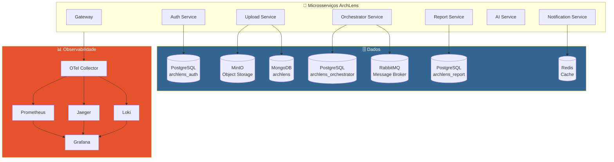
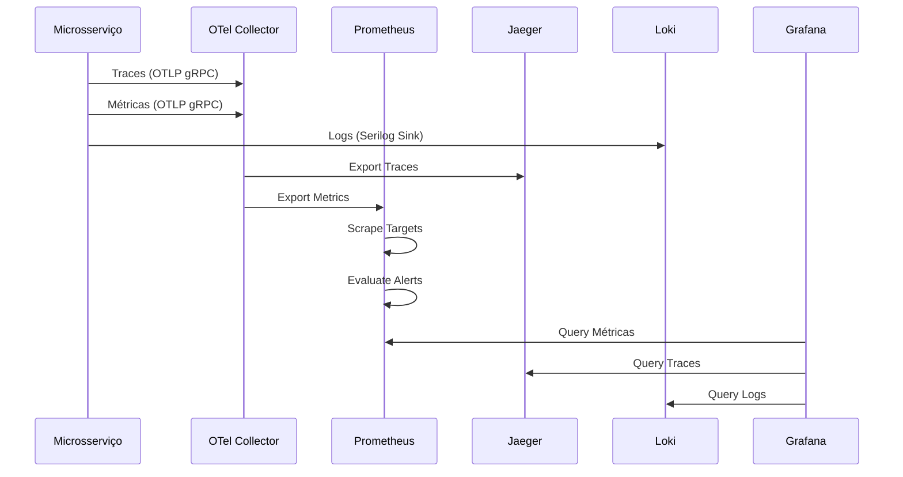
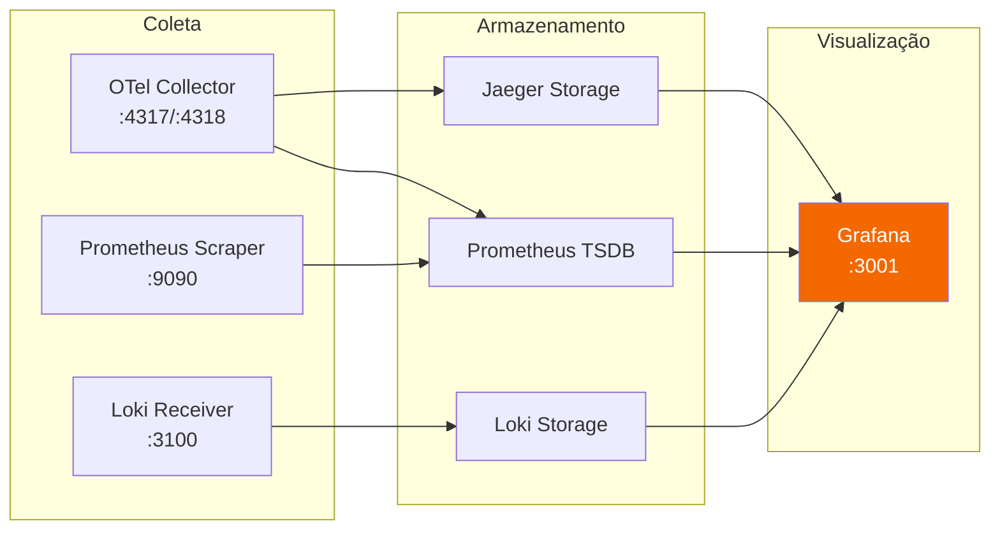

# 🗄️ ArchLens - Infraestrutura de Banco de Dados e Observabilidade

[](https://github.com/ArchLens-Fiap/archlens-infra-db/actions/workflows/ci.yml) [](https://sonarcloud.io/dashboard?id=ArchLens-Fiap_archlens-infra-db) [](https://sonarcloud.io/dashboard?id=ArchLens-Fiap_archlens-infra-db)

> **Configurações Docker para Infraestrutura de Serviços**
> Hackathon FIAP - Fase 5 | Pós-Tech Software Architecture + IA para Devs
>
> **Autor:** Rafael Henrique Barbosa Pereira (RM366243)

[](https://www.docker.com/)
[](https://www.postgresql.org/)
[](https://www.mongodb.com/)
[](https://redis.io/)
[](https://prometheus.io/)
[](https://grafana.com/)

---

## 📋 Descrição

O **ArchLens Infra DB** centraliza todas as configurações de infraestrutura para o ambiente de desenvolvimento local da plataforma ArchLens. Inclui bancos de dados, message broker, object storage e stack completa de **observabilidade** (Prometheus, Grafana, Jaeger, Loki, OTel Collector).

---

## 🏗️ Arquitetura



---

## 🔄 Fluxo de Observabilidade



---

## 🛠️ Serviços Configurados

| Serviço | Tipo | Porta | Descrição |
|---------|------|-------|-----------|
| **PostgreSQL** | Banco de Dados | 5432 | 3 databases (auth, orchestrator, report) |
| **MongoDB** | Banco de Dados | 27017 | Armazenamento de metadados |
| **Redis** | Cache/Pub-Sub | 6379 | Cache e notificações |
| **MinIO** | Object Storage | 9000/9001 | Armazenamento de diagramas |
| **RabbitMQ** | Message Broker | 5672/15672 | Comunicação assíncrona |
| **Prometheus** | Monitoramento | 9090 | Coleta de métricas + alertas |
| **Grafana** | Dashboards | 3001 | Visualização de dados |
| **Jaeger** | Tracing | 16686 | Traces distribuídos |
| **Loki** | Logs | 3100 | Agregação de logs |
| **OTel Collector** | Telemetria | 4317/4318 | Pipeline de observabilidade |

---

## 📁 Estrutura do Projeto

```
archlens-infra-db/
├── docker/
│   ├── prometheus/
│   │   ├── prometheus.yml              # Configuração de scrape targets
│   │   └── alerts.yml                  # Regras de alerta
│   │
│   ├── otel/
│   │   └── otel-collector-config.yml   # Pipeline OTel Collector
│   │
│   ├── grafana/
│   │   ├── dashboards/                 # Dashboards pré-configurados
│   │   │   ├── archlens-overview.json
│   │   │   └── archlens-services.json
│   │   └── datasources/
│   │       └── datasources.yml         # Prometheus, Jaeger, Loki
│   │
│   └── postgres/
│       └── init.sql                    # Script de inicialização
│
├── docker-compose.yml                  # Compose principal
├── .env.example                        # Variáveis de ambiente
├── .gitignore
└── README.md
```

---

## 📊 Configuração do Prometheus

### Scrape Targets

| Target | Endpoint | Intervalo |
|--------|----------|-----------|
| Gateway | `gateway:5000/metrics` | 15s |
| Auth Service | `auth-service:5120/metrics` | 15s |
| Upload Service | `upload-service:5066/metrics` | 15s |
| Orchestrator | `orchestrator-service:5089/metrics` | 15s |
| Report Service | `report-service:5205/metrics` | 15s |
| AI Service | `ai-service:8000/metrics` | 15s |
| Notification | `notification-service:5150/metrics` | 15s |

### Alertas Configurados

| Alerta | Condição | Severidade |
|--------|----------|------------|
| `ServiceDown` | Target down > 1min | critical |
| `HighErrorRate` | Error rate > 5% | warning |
| `HighLatency` | P95 > 2s | warning |
| `HighMemoryUsage` | Memory > 80% | warning |

---

## 🔧 Grafana Datasources

| Datasource | Tipo | URL |
|------------|------|-----|
| Prometheus | Métricas | `http://prometheus:9090` |
| Jaeger | Traces | `http://jaeger:16686` |
| Loki | Logs | `http://loki:3100` |

---

## 📦 Databases PostgreSQL

| Database | Serviço | Tabelas Principais |
|----------|---------|-------------------|
| `archlens_auth` | Auth Service | Users, Roles, RefreshTokens |
| `archlens_orchestrator` | Orchestrator Service | Analyses, ProcessingSteps |
| `archlens_report` | Report Service | Reports, ReportSections |

---

## 🚀 Como Executar

### Quick Start

```bash
# Subir toda a infraestrutura
docker-compose up -d

# Verificar status dos serviços
docker-compose ps

# Ver logs
docker-compose logs -f
```

### Interfaces Web

| Serviço | URL | Credenciais |
|---------|-----|-------------|
| RabbitMQ Management | `http://localhost:15672` | guest / guest |
| MinIO Console | `http://localhost:9001` | minioadmin / minioadmin |
| Prometheus | `http://localhost:9090` | - |
| Grafana | `http://localhost:3001` | admin / admin |
| Jaeger UI | `http://localhost:16686` | - |

---

## 🔧 Variáveis de Ambiente

| Variável | Descrição | Default |
|----------|-----------|---------|
| `POSTGRES_USER` | Usuário PostgreSQL | `postgres` |
| `POSTGRES_PASSWORD` | Senha PostgreSQL | `postgres` |
| `MONGO_INITDB_ROOT_USERNAME` | Usuário MongoDB | `admin` |
| `MONGO_INITDB_ROOT_PASSWORD` | Senha MongoDB | `admin123` |
| `MINIO_ROOT_USER` | Usuário MinIO | `minioadmin` |
| `MINIO_ROOT_PASSWORD` | Senha MinIO | `minioadmin` |
| `RABBITMQ_DEFAULT_USER` | Usuário RabbitMQ | `guest` |
| `RABBITMQ_DEFAULT_PASS` | Senha RabbitMQ | `guest` |

---

## 🐳 Comandos Úteis

```bash
# Parar tudo
docker-compose down

# Parar e limpar volumes (reset completo)
docker-compose down -v

# Recriar um serviço específico
docker-compose up -d --force-recreate prometheus

# Ver métricas do Prometheus
curl http://localhost:9090/api/v1/targets
```

---

## 📈 Stack de Observabilidade



---

FIAP - Pós-Tech Software Architecture + IA para Devs | Fase 5 - Hackathon (12SOAT + 6IADT)
